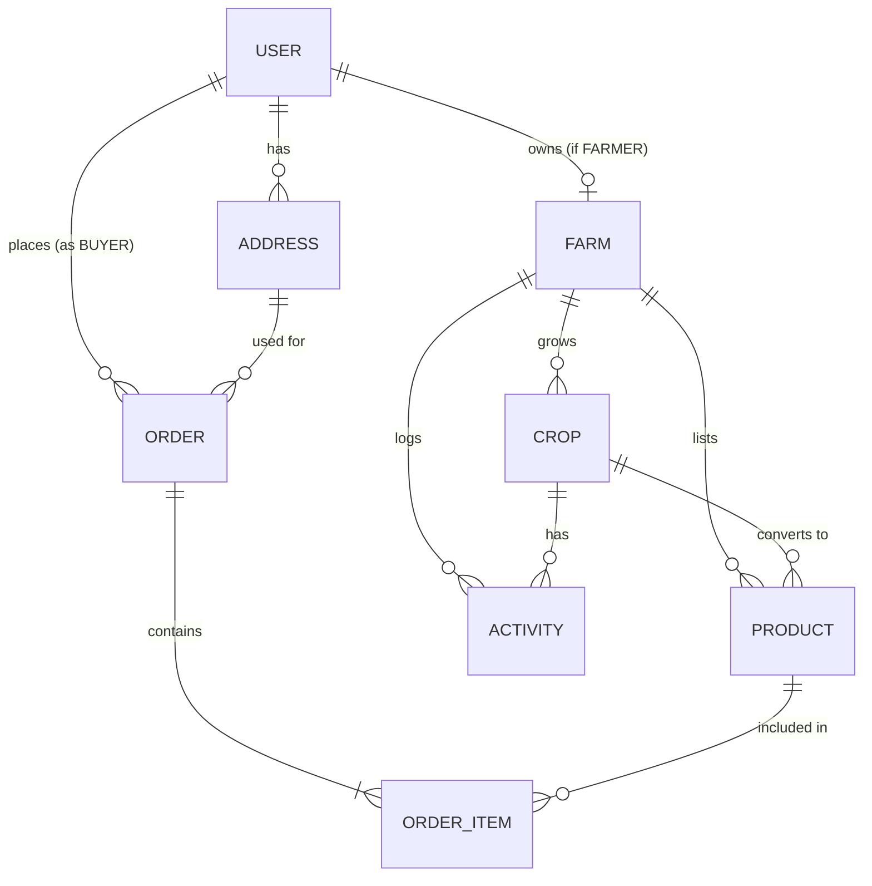

# FarmFlow - Database Schema & Architecture

This document outlines the database design for FarmFlow, managed via Prisma ORM and hosted on Supabase PostgreSQL.

## 1. Schema Overview

The database consists of 8 core models supporting the marketplace, farm operations, and notifications:
- **User:** Manages authentication, profiles, and roles (Admin, Farmer, Buyer).
- **Farm:** Central hub for a farmer's operations. Linked 1-to-1 with a Farmer User.
- **Crop:** Represents the agricultural yield lifecycle on a farm.
- **Product:** The marketplace listing derived from a Crop (or created standalone).
- **Order & OrderItem:** E-commerce transaction records.
- **Address:** User delivery/billing addresses.
- **Activity:** Audit/log of farm activities (planting, fertilizing, harvesting).
- **Notification:** System notifications for users.

## 2. Entity Relationship Diagram (ERD)

## 3. Data Integrity & Cascades
To maintain a clean database and prevent orphan records, cascading deletes are implemented:
- Deleting a `User` cascades to delete their `Farm`, `Orders`, and `Addresses`.
- Deleting a `Farm` cascades to delete its `Crops`, `Products`, and `Activities`.
- Deleting a `Product` or `Order` cascades to delete the respective `OrderItem`s.
- `Crop` to `Product`/`Activity` is `SetNull` so historical marketplace listings and activity logs remain intact even if the crop record is removed.

## 4. Row Level Security (RLS) & Security Policies
Since we are using Prisma from a secure Node.js environment (Next.js Server Components / Server Actions), database operations are performed via a secure server environment using the `DATABASE_URL`. 
- **Prisma Bypass:** Prisma operates with service-level access, bypassing Supabase RLS.
- **Application-Level Security:** We enforce security and authorization within our Next.js Server Actions and API Routes. Before executing a Prisma query, we MUST verify the user's session and role.
  - *Example:* A farmer can only update a `Product` if `product.farm.userId === currentUser.id`.

## 5. Migrations
Database schema changes are strictly managed through Prisma Migrations.
- **Development:** `npx prisma migrate dev --name <migration_name>`
- **Production:** `npx prisma migrate deploy`
- Never modify the database schema directly through the Supabase UI. Always update `schema.prisma` and run a migration to ensure code and database stay synchronized.

## 6. Enums Dictionary
- **Role:** ADMIN, FARMER, BUYER
- **CropStage:** SEEDLING, GROWING, READY_TO_HARVEST, HARVESTED
- **OrderStatus:** PENDING, CONFIRMED, READY, DELIVERED, CANCELLED
- **PaymentStatus:** PENDING, PAID, FAILED, REFUNDED
- **ListingStatus:** ACTIVE, PENDING_REVIEW, REMOVED
- **FarmerStatus:** PENDING, VERIFIED, SUSPENDED
- **NotificationType:** NEW_USER, PENDING_FARMER, NEW_LISTING, NEW_ORDER, ORDER_STATUS_CHANGE, PAYMENT_CONFIRMED
